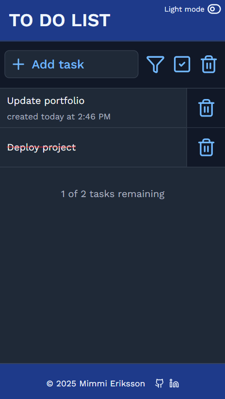
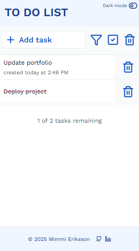

# Todo App 
A simple todo app built in React using Zustand for state management. \
Users are able to add, list, filter and remove tasks, and toggle whether a task is completed or not.

## Features
* Each task has a time stamp when it was created
* A task can be marked as completed (or uncompleted) by clicking the task
* A task can be deleted by clicking the trash bin icon next to each task
* All tasks can be deleted by clicking the trash bin icon in the top control bar
* All tasks can be marked as completed by clicking the check box icon in the top control bar
* Uncompleted tasks can be filtered out by clicking the funnel icon in the top control bar
* Toggle between light/dark mode by clicking the toggle button in the header

## Installation & Usage
Install the required dependencies by running the following command:
```
npm install
```
Start the server by running:
```
npm run dev
```

## Link
https://task-completed.netlify.app/

## Screenshots
<span>


</span>
